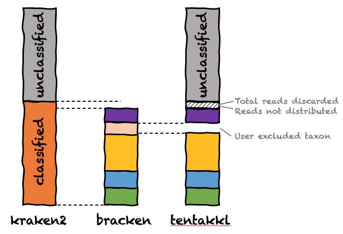

# TENTAKKL
Taxonomic Extraction Normalization Transformation and Accounting for Kraken/bracKen fiLes


This is a pre-beta release. Probably not suitable for your purposes yet...

Kraken and Bracken are highly-cited tools for classifying short read data and generating relative abundances.

This tool reads standard bracken and kraken reports and performs a variety of operations. Perhaps best described with a figure:



tentakkl:

* Selects out target taxa to report
* Allows the user to drop taxa from consideration
* Recovers reads lost by bracken (reported in STDOUT as "reads discarded" and "reads not distributed"
* Recovers unclassified reads from the kraken2 reports
* Supports output of raw counts, normalization to bracken (essentially classified reads) or kraken2 (essentially classified+unclassified)
* Supports list (tidy) and wide (Excel-compatible) outputs
 
```
14:20 biowulf minitax$ perl -w tentakkl.pl 
TENTAKKL v0.1
Taxonomic Extraction Normalization Transformation and Accounting for Kraken/bracKen fiLes

usage perl -w tentakkl.pl [options] -config minitax.cfg -bracken kraken_output/*_bracken.kreport

-config file       list of target taxa, text file, one taxon per line
                   preface taxon with '-' to have reads at that level removed. Child taxa unaffected
-bracken files     bracken-corrected kraken taxonomy reports
-kraken files      [optional] kraken taxonomy reports, used to extract unclassified reads
-out file          output filename (STDOUT by default)
-outfmt list|wide  list=tidy or wide=matrix; list has counts and normalized; wide uses normalize option
-normalize n|b|k   (outfmt=wide) n=counts
                                 b=normalize to 1 using bracken total
                                 k=normalize to 1 using kraken total (incl. unclassified)
-add_lost          add reads lost during bracken read reassignment to a root taxon
-add_unclassified  add unclassified reads category
-precision int     number of decimal places when normalizing
-verbose int       0=no info, 1=file-level info, 2=taxa-level info
```
