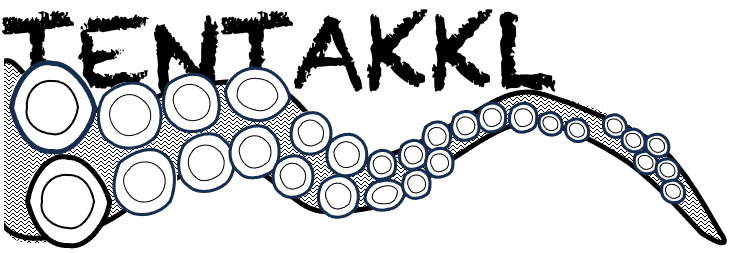

# TENTAKKL
Taxonomic Extraction Normalization Transformation and Accounting for Kraken/bracKen fiLes



Kraken and Bracken are highly-cited tools for classifying short read data and generating relative abundances. This tool reads standard bracken reports and performs a variety of operations.

This is a pre-beta release. Probably not suitable for your purposes yet...

```
09:41 biowulf minitax$ perl -w tentakkl.pl 
TENTAKKL
Taxonomic Extraction Normalization Transformation and Accounting for Kraken/bracKen fiLes

usage perl -w tentakkl.pl [options] -config minitax.cfg -bracken kraken_output/*_bracken.kreport

-config file       list of target taxa, text file, one taxon per line
                   preface taxon with '-' to have reads at that level removed. Child taxa unaffected
-bracken files     bracken-corrected kraken taxonomy reports
-out file          output filename (STDOUT by default)
-outfmt list|wide  list=tidy or wide=matrix; list has counts and normalized
  -normalize n|b   (outfmt=wide) n=counts, b=normalize to 1
-addroot           add reads lost during bracken read reassignment to root
-precision int     number of decimal places when normalizing
-verbose int       0=no info, 1=file-level info, 2=taxa-level info
```
